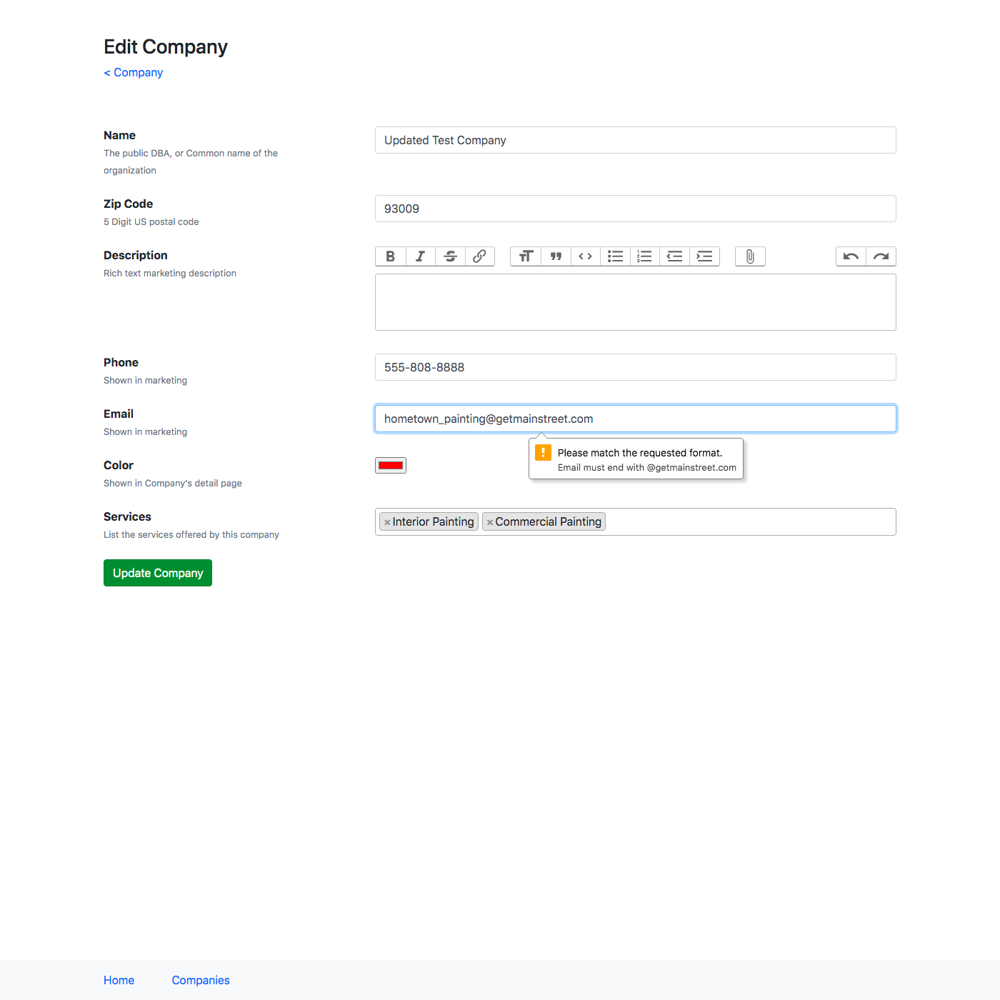

# Code Challenge

## Things that are complete

- I have added validation to email in company model with given conditions
- I have added delete button in show page and also asking for confirmation on the process
- For state and city info in company show page, I have added a function in callbacks methods to fetch the relevant information from zipcode gem and store it in table ( db columns state, city were created)
- For brand color, I have added a column color in database to store information and a field in UI form to get user input
- Rspec test script is written for company model considering various cases
- Controller test cases are written on UI for various create/update/delete operations.
- Sandbox information about deployment is added in config/deploy/production.rb file. Deloyment is done using capitron and passenger. Deployer can go through documention https://github.com/capistrano/capistrano/blob/master/README.md

## Things that are not working as expected

- Email validation on UI was cuasing issue with the same regex that I used in validation on company model. Reference for the error is shown in the image below. Currently I have removed that validation on the user side since its presence was obstructing creation and updation of company details.

